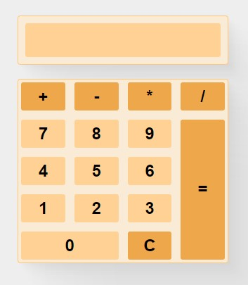

# Calculator App

## :pushpin: What is it?
This is a simple <strong>Calculator App</strong> built on Nuxt 3. 
The app allows you to perform four basic mathematical operations (+ - * /), including operations with negative numbers.
## :pushpin: What is used?
+ Vue 3 / Nuxt 3
+ Grid
+ BEM Methodology
+ SCSS
+ Eslint
+ Google Fonts
## :pushpin: Structure
App consists of three components:
+ **Main component** 
    This component includes rest two components and main app logic.
+ **Screen component** 
    This component displays the operations entered by the user and end result.
+ **Buttons component** 
    This component contains app buttons and button event handlers.
+ Main SCSS file with common styles.
## :pushpin: Features
+ You can use the first operand as a negative number.
+ If you don't enter the numbers before pressing the "=" (even with selected math operator), you'll receive a message: "Please enter the number".
+ If you try to divide by zero, you'll receive a message: "Cant be divided by zero".
